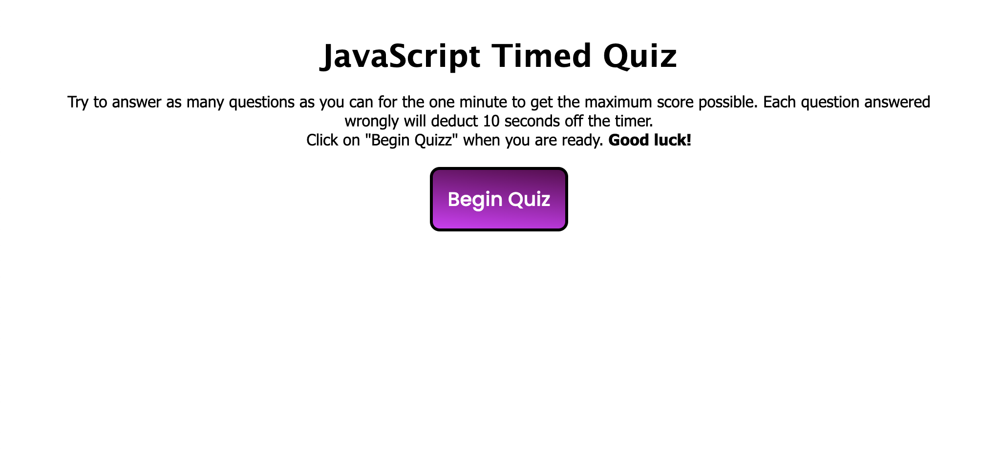
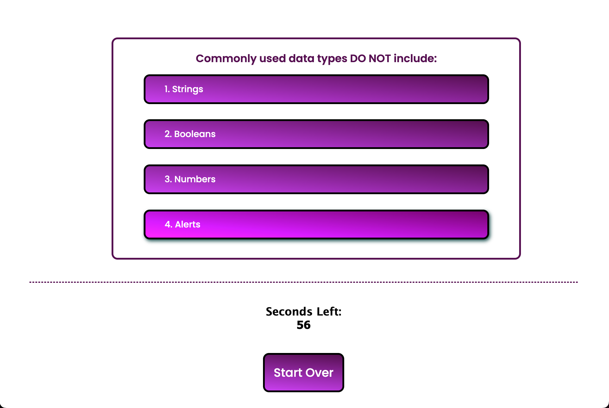

# APIs and JavaScript Timed Quiz

This has been the hardest project to complete so far. As you can see, the quiz should function, the questions are shuffled. They show correct or incorrect by adding color to the button, green if correct and red for incorrect. 


## Acceptance Criteria

```
GIVEN I am taking a code quiz
WHEN I click the start button
THEN a timer starts and I am presented with a question
WHEN I answer a question
THEN I am presented with another question
WHEN I answer a question incorrectly
THEN time is subtracted from the clock
WHEN all questions are answered or the timer reaches 0
THEN the game is over
WHEN the game is over
THEN I can save my initials and my score
```

## Screenshots





## URL

**Please View the Final page here: [View APIs Quiz Website](https://yuyitax.github.io/04-apis-challenge/)

---

© 2022 Cristina Yunes, AKA Yuyitax. All Rights Reserved.
